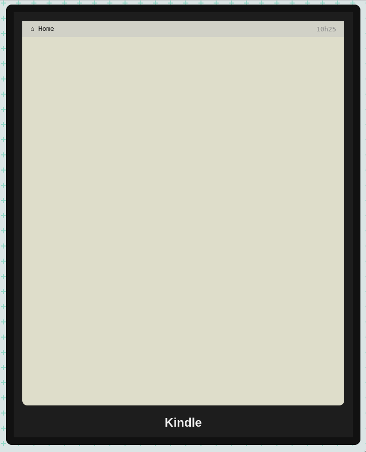

# Réparation de Kindle

Ma liseuse est KC ! Euh, cassée ! J'aurais besoin de fieffés réparateurs de liseuses pour la réparer !

Vous connaissez un peu de PHP, de JS et de CSS ? Mais vous êtes la personne qu'il me faut !

Comme vous le voyez, son écran n'affiche plus rien. Laissez-moi vous expliquer comment elle fonctionnait avant la panne.

## Étape 1 - PHP

Par défaut, elle m'affichait une [liste de couvertures de livres](resultat/home.png).

D'après le manuel technique, les livres sont récupérés depuis le tableau `$books` du fichier *books.php* :thinking: Et les images viennent du dossier images. Apparement, tout est en place, le problème doit être au moment de la récupération des données…

Indice

Vous n'avez *jamais besoin d'écrire le titre des livres en dur*, ils existent déjà : l'objectif est de les récupérer automatiquement depuis le tableau, avec une itération.

## Étape 2 - PHP

Je me souviens que quand je cliquais sur la couverture d'un livre, j'arrivais sur [un écran dédié](resultat/livre.png).

Le manuel technique parle d'un paramètre GET, qui permettrait à la liseuse de savoir quel livre charger… Et ça dit que les livres sont stockés dans le dossier, euh, `livres/`, dans des fichiers du même nom que le titre de livre.

## Étape 3 - JS

Ah oui ! Un dernier truc. Sur la page d'accueil, je pouvais alterner entre deux modes d'affichage des livres :

- avec les couvertures (du coup c'est bon)
- avec une [liste détaillée](resultat/liste.png)

Il suffisait que je clique sur « Changer de vue » en bas.

---

Indice général : pour toutes les étapes, en plus de PHP et JS, vous devrez aussi utiliser CSS afin que ça ressemble le plus possible aux [résultats attendus](resultat/) :pray:

La `correction` est disponible sur la branche du même nom !
